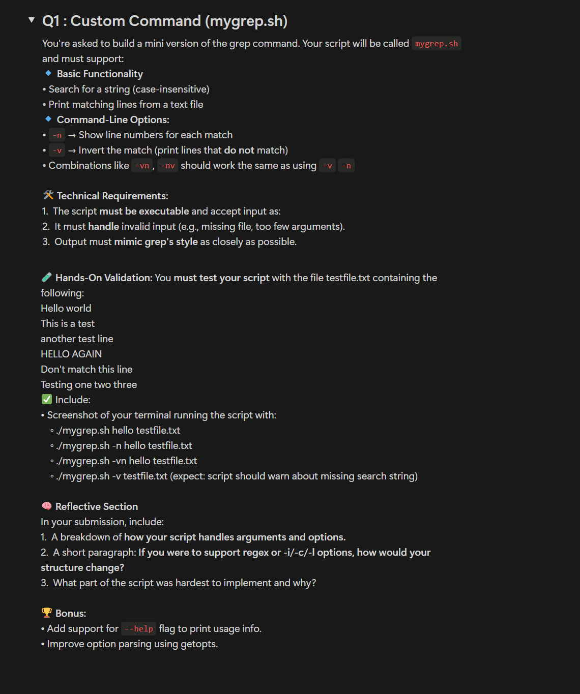
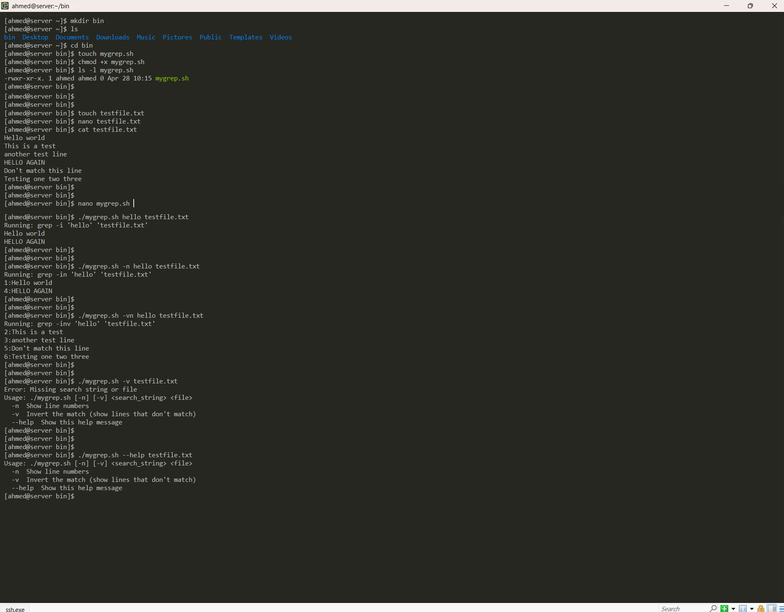

# Custom Command: `mygrep.sh`

This script mimics the functionality of the `grep` command with additional options like displaying line numbers and inverting the match. It allows searching through files with flexibility and error handling.

## Steps to Setup:


1. **Create the required directory and files:**

   ```bash
   mkdir bin
   cd bin
   touch testfile.txt mygrep.sh
   chmod +x mygrep.sh
   ```

2. **Add content to `testfile.txt`:**

   Open `testfile.txt` and add the following lines:

   ```
   Hello world
   This is a test
   another test line
   HELLO AGAIN
   Don't match this line
   Testing one two three
   ```

3. **Write the script `mygrep.sh`:**

   Open `mygrep.sh` and paste the following content:

   ```bash
   #!/bin/bash

   # Function to print usage
   usage() {
     echo "Usage: $0 [-n] [-v] <search_string> <file>"
     echo "  -n  Show line numbers"
     echo "  -v  Invert the match (show lines that don't match)"
     echo "  --help  Show this help message"
     exit 1
   }

   # Function to handle the grep-like behavior
   mygrep() {
     local search_string=""
     local file=""
     local invert_match=false
     local show_line_numbers=false

     # Parse options
     while getopts ":nv" opt; do
       case $opt in
         n) show_line_numbers=true ;;
         v) invert_match=true ;;
         \?) usage ;;
       esac
     done

     # Shift to process search_string and file
     shift $((OPTIND - 1))

     # Now, $1 should be the search string and $2 should be the file
     search_string="$1"
     file="$2"

     # Check if search string or file are missing
     if [ -z "$search_string" ] || [ -z "$file" ]; then
       echo "Error: Missing search string or file"
       usage
     fi

     # Check if the file exists
     if [ ! -f "$file" ]; then
       echo "Error: File '$file' does not exist"
       exit 1
     fi

     # Construct the grep command with options
     if $invert_match && $show_line_numbers; then
       echo "Running: grep -inv '$search_string' '$file'"  # Debugging output
       grep -inv "$search_string" "$file" || echo "No matches found"
     elif $invert_match; then
       echo "Running: grep -iv '$search_string' '$file'"  # Debugging output
       grep -iv "$search_string" "$file" || echo "No matches found"
     elif $show_line_numbers; then
       echo "Running: grep -in '$search_string' '$file'"  # Debugging output
       grep -in "$search_string" "$file" || echo "No matches found"
     else
       echo "Running: grep -i '$search_string' '$file'"  # Debugging output
       grep -i "$search_string" "$file" || echo "No matches found"
     fi
   }

   # Handle --help flag
   if [ "$1" == "--help" ]; then
     usage
   fi

   # Call the mygrep function with arguments
   mygrep "$@"
   ```

---

## How the Script Handles Arguments and Options:

- **Arguments**:  
  The script first checks for the `--help` flag and displays the usage instructions if it's present.
  
- **Options**:  
  It uses `getopts` to parse options like `-n` (show line numbers) and `-v` (invert match). After processing the options, the remaining arguments are assigned as the search string and the file name.

- **Error Handling**:  
  - If any required arguments are missing or if the file doesn't exist, the script will show an error message and exit.  
  - The script also ensures that the options are processed first before the search string and file.

---

## Supporting Regex, -i, -c, and -l Options:

- **Regex**:  
  The `grep` command supports regular expressions by default, so you don't need any additional options for basic regular expressions. If you want to use extended regular expressions, you can add a `-r` option.

- **Additional Options**:
  - **-i**: Case-insensitive search, already supported.
  - **-c**: Count the number of matches instead of printing the lines.
  - **-l**: List filenames that contain matches (can be added if needed).

---

## Hardest Part of the Script:

- The most challenging part was correctly handling the `-n` and `-v` options, especially when options are mixed with positional arguments. Ensuring that options are processed first and applied correctly to the `grep` command was complex.

---

## Output:

