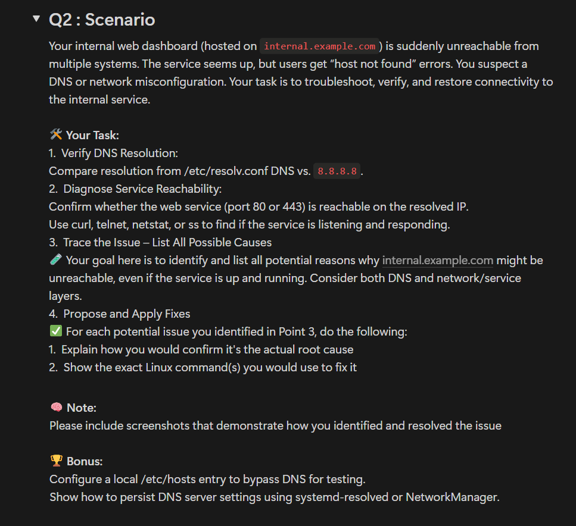
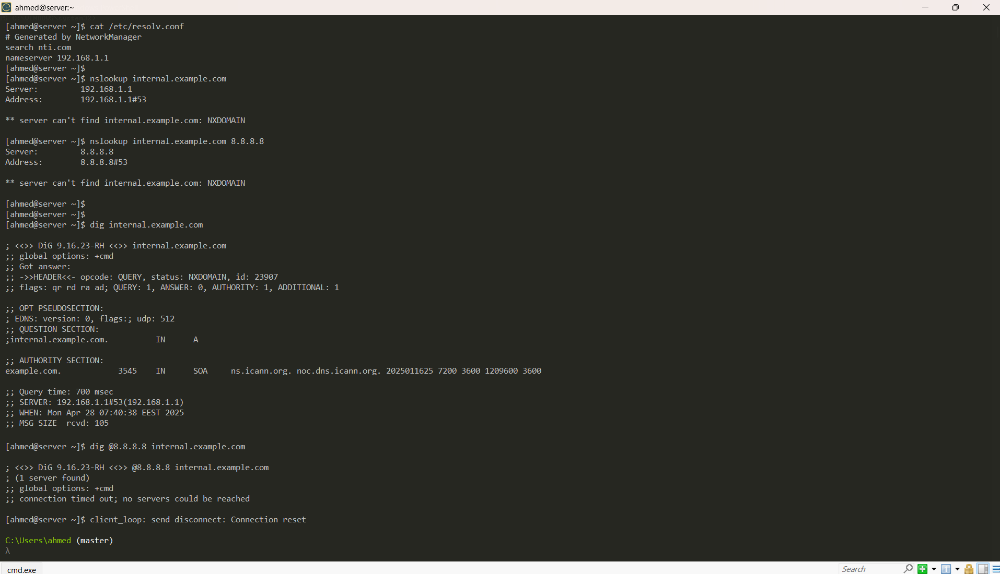
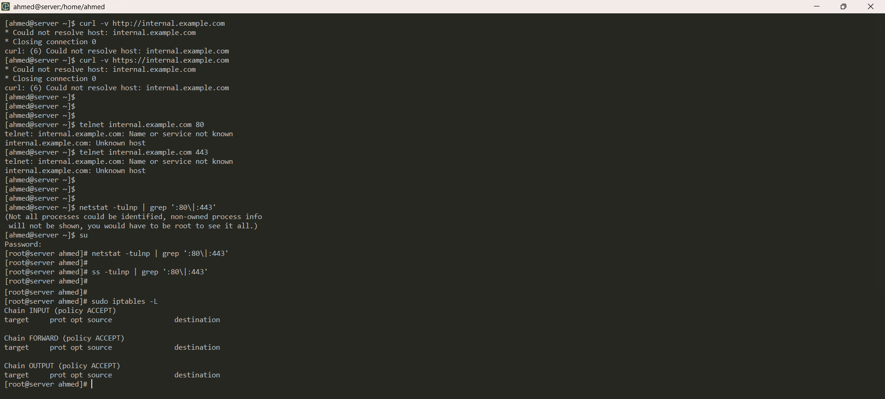
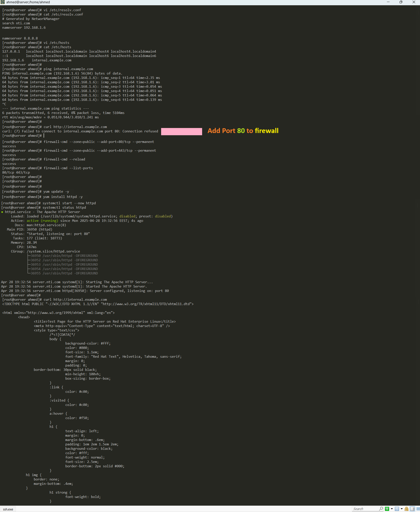
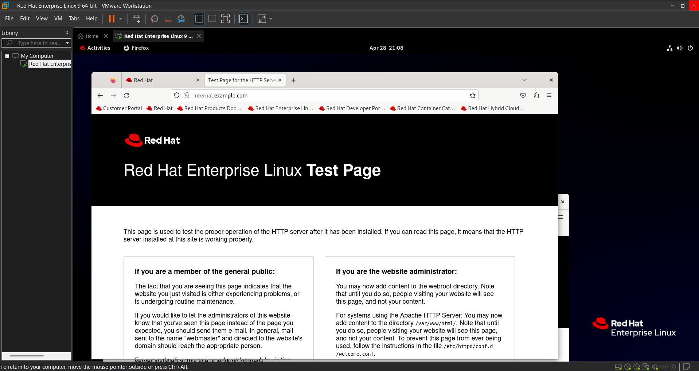

# Q2 : Scenario


### 1. Verify DNS Resolution:
```bash
Compare resolution from /etc/resolv.conf DNS vs. 8.8.8.8.

# Test DNS Resolution using the "internal DNS servers" through [ nslookup or dig ]
# Test DNS resolution using Google Public DNS "8.8.8.8"  -----> Check if the Problem is with the internal DNS or Not

# → Check if i can get an IP address or an error.

```



### 2. Diagnose Service Reachability
```bash
Confirm whether the web service (port 80 or 443) is reachable on the resolved IP.
Use curl, telnet, netstat, or ss to find if the service is listening and responding.

```



### 3. Trace the Issue – List All Possible Causes
```bash
There are several potential causes for the issue:
  1. DNS Configuration Issues:
      . Internal DNS server misconfigured or down.
      . Incorrect DNS records for "internal.example.com".
      . Network segmentation or DNS resolution issues in your internal network.

  2. Service Misconfiguration:
      . The web service might be misconfigured and not responding to requests properly.
      . The web server could be misconfigured (e.g., missing server blocks for HTTP/HTTPS).

  3. Network or Firewall Issues:
      . The web server might not be listening on the expected ports (80/443).
      . Firewall blocking incoming traffic on ports 80/443.
      . Misconfigured security groups (if using cloud infrastructure).

```

### 4. Propose and Apply Fixes
```bash

  1. DNS Configuration Issues:
      # Add IP os " machine & Add Google Public DNS
      vi /etc/resolv.conf

      # Add   IP   internal.example.com
      vi /etc/hosts 

  2. Service Misconfiguration:
      # Install "httpd" to expose "internal.example.com" on browser
      sudo yum update -y
      sudo yum install httpd -y
      # Start & Enable 
      systemctl start --now httpd
      # Check Status
      systemctl status httpd

      curl http://internal.example.com      ----->  Display Connection refused so

  3. Network or Firewall Issues:
      # Allow "Port 80, 443"
      firewall-cmd --zone=public --add-port=80/tcp --permanent
      firewall-cmd --zone=public --add-port=443/tcp --permanent

      # Don't forget to reload "Firewall"
      firewall-cmd --reload 

# Q2 : Scenario


### 1. Verify DNS Resolution:
```bash
Compare resolution from /etc/resolv.conf DNS vs. 8.8.8.8.

# Test DNS Resolution using the "internal DNS servers" through [ nslookup or dig ]
# Test DNS resolution using Google Public DNS "8.8.8.8"  -----> Check if the Problem is with the internal DNS or Not

# → Check if i can get an IP address or an error.
```


### 2. Diagnose Service Reachability
```bash
Confirm whether the web service (port 80 or 443) is reachable on the resolved IP.
Use curl, telnet, netstat, or ss to find if the service is listening and responding.
```


### 3. Trace the Issue – List All Possible Causes
```bash
There are several potential causes for the issue:
  1. DNS Configuration Issues:
      . Internal DNS server misconfigured or down.
      . Incorrect DNS records for "internal.example.com".
      . Network segmentation or DNS resolution issues in your internal network.

  2. Service Misconfiguration:
      . The web service might be misconfigured and not responding to requests properly.
      . The web server could be misconfigured (e.g., missing server blocks for HTTP/HTTPS).

  3. Network or Firewall Issues:
      . The web server might not be listening on the expected ports (80/443).
      . Firewall blocking incoming traffic on ports 80/443.
      . Misconfigured security groups (if using cloud infrastructure).
```

### 4. Propose and Apply Fixes
```bash
  1. DNS Configuration Issues:
      # Add IP to "machine" & Add Google Public DNS
      vi /etc/resolv.conf

      # Add IP for internal.example.com
      vi /etc/hosts 

  2. Service Misconfiguration:
      # Install "httpd" to expose "internal.example.com" on browser
      sudo yum update -y
      sudo yum install httpd -y
      # Start & Enable 
      systemctl start --now httpd
      # Check Status
      systemctl status httpd

      curl http://internal.example.com      ----->  Display Connection refused so

  3. Network or Firewall Issues:
      # Allow "Port 80, 443"
      firewall-cmd --zone=public --add-port=80/tcp --permanent
      firewall-cmd --zone=public --add-port=443/tcp --permanent

      # Don't forget to reload "Firewall"
      firewall-cmd --reload 

      # Try Again will Open
      curl http://internal.example.com
```

### Output


```bash
     # Expose it on Browser will open too
    http://internal.example.com
```


```